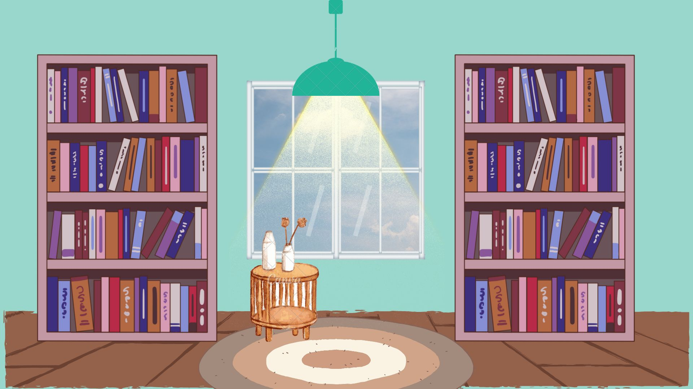

:warning: Everything between << >> needs to be replaced (remove << >> after replacing)

# << Welcome to my Library! >>
## CS110 Final Project  << Spring, 2024 >>

## Team Members

<< Christine Nemecek >>

***

## Project Description

<< I would like to create a program that simulates a digital library and showcases excerpts of books when you click on them. They will be on what appear to be digital bookshelves and open up to show you the inside of them with passages from the stories!>>

***    

## GUI Design

### Initial Design

### Final Design

## Program Design

### Features

1. << welcome/start menu >>
2. << interactive books, click and open >>
3. << movement of book to main screen/enlarged>>
4. << windowpane with scrolling background of clouds >>
5. << background music >>

### Classes

- << 
1. class Book: contains some of the code initializing the book, and allows it to be moved to either the left or the right of the screen

2. class Window: initializes code for the moving clouds, has code for it to be moving towards the right of the screen.
>>

## ATP

| Step                 |Procedure             |Expected Results                   |
|----------------------|:--------------------:|----------------------------------:|
|  1                   | Run Counter Program  |GUI window appears with count = 0  |
|  2                   | click count button   | display changes to count = 1      |
etc...
