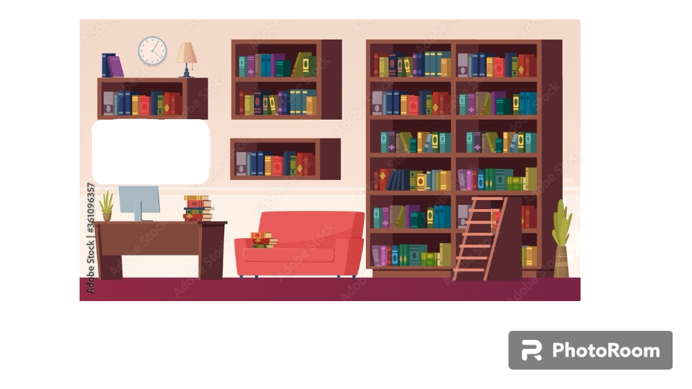

# Welcome to my Library!
## CS110 Final Project Spring, 2024 

## Team Members

Christine Nemecek 

***

## Project Description

I would like to create a program that simulates a digital library and showcases different Harry Potter spells when you click on them. Each time you open a book you will get a different spell, and you can save your favorites!

***    

## GUI Design

### Initial Design

### Final Design

## Program Design

### Features

1. welcome/start menu 
2. interactive bookshelf, open book
3. save book button
4. windowpane with scrolling background of clouds
5. clear saved book screen

### Classes

- Book: initializes book that will pop up on the screen, creates rect and sets up sizing
- Window: initializes code for the moving clouds
- API: sets up my external API to call a random spell every time the code is run and set up in a tuple
- BookSave: initializes book that will pop up on the screen to track saved spells, creates rect and sets up sizing
- BookShelf: initializes bookshelf, creates rect and sets up sizing
- Button: initializes the image, sizing and rect of the buttons that will be utilized
- FrontDesk: initializes front desk, creates rect for coding collision
- Heart: initializes heart that will pop up on book excerpts, creates rect and sets up sizing
- Library: initializes the main background, sizing
- Reset: Has the reset button for clearing the book of saved spells, sets up sizing and creates rect

## ATP
Test Case 1: Menu Selection
    Test Description: Verify that the menu button comes up when the game first opens and that the "Yes" button allows  the player to continue through the game; removing the pop up screen

    Test Steps:
    1. Start the game
    2. Make sure the pop up menu comes up correctly
    3. When 'Yes' is clicked, the menu vanishes

    Expected Outcome: The main menu should pop up, provide some context for the user, and disappear once 'Yes' is clicked

Test Case 2: Bookcase/Front Desk selection
    Test  Description: Verify that the bookcase and mouse collision is accurate (within rect outline of bookcase) and that it prompts a book to appear on the screen

        1. Start the game
        2. Click on the bookcase
        3. Verify that a book pops up with a random excerpt
        4. Click on the front desk
        5. Verify that a book pops up

    Expected Outcome: When the bookcase is selected, an open book should pop up in the center of the screen displaying the excerpt of a book

Test Case 3: Book Excerpt 
    Test Description: Verify that every time a book is displayed from the bookcase it is different every time. 

    1. Start the game
    2. Click on the bookcase
    3. Check to make sure the book can be correctly exited
    4. Click on the bookcase again
    5. Make sure the same excerpt has not been shown again

    Expected Outcome: When the bookcase is selected, there should be a different book excerpt that comes up every time and the exit feature should work smoothly

Test Case 4: Save the Name
    Test Description: Verify that when a user likes a book (wants to save its title because they are interested) it properly keeps them in another book by the front desk

    1. Start the game
    2. click on the bookcase
    3. save a book 
    4. click on the front desk
    5. check that the title is listed/displayed in that book

    Expected Outcome: When saving a book from the bookcase/flagging your interest it should be added to a list that is being kept in the front desk that is accessible at any time to view

Test Case 5: Clear the Book
    Test Description: Verify that when clicking "Clear", the list beinng kept at the front desk is erased

    1. Start the game
    2. click on the bookcase
    3. save a book
    4. click on the front desk
    5. click clear in the right corner

    Expected Outcome: When "clear" is clicked on the corner of the book at the front desk after saving any number of titles, the list should be cleared/refreshed to start a new one.

| Step                 |Procedure             |Expected Results                   |
|----------------------|:--------------------:|----------------------------------:|
|  1                   | Run Counter Program  |GUI window appears with count = 0  |
|  2                   | click count button   | display changes to count = 1      |
etc...
